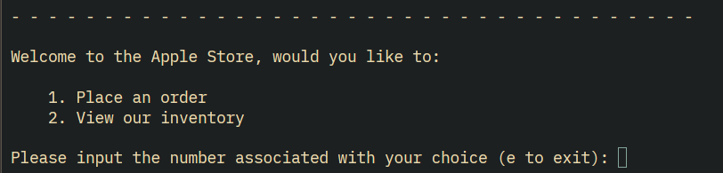

# E-Commerce Script
## Objective:
Simulate the processes of E-Commerce using basic python. 
This script uses basic python constructs to create the E-Commerce experience of navigating through a store menu, slecting a product, and ordering it. The terminal imitates a website, and the user is able to travel back and forth through the interface as well.

## Structure
Again, this program uses basic constructs in python (dictionaries, loops, functions, etc) and was built around using **control flow** to manage the running of the program.

Constructs like **loops** are nested repeatitively in a sequence for the movement of a user between "pages" of terminal.

The program is navigated by using numbers to select options on the interface. For instance, when wanting to choose an option on the menu in the image below, you would
enter either 1 or 2 (just the number itself, no add-ons):

There is also exception handling built into every "option selector" in the program. This was accomplished by using `try` and `except` loops to manage inputs that would break the system.

## Using the Script
By using this script you will be able to experience the basic functions of an E-Commerce store. Switching back and forth between "pages" of the program is operated by using a variable (most of the time "e") to exit the phase and selecting a number on the menu to go to a "page". It's designed to be easy to use.

## Reflection
As a starter project, this script was beneficial for understanding the basics of python. Actually understanding fundamentals such as loops, functions, and exception handling is a good foundation to build on.
As of right now I have bigger projects planned, projects to expand and to grow my knowledge of python, and become a better software engineer.
